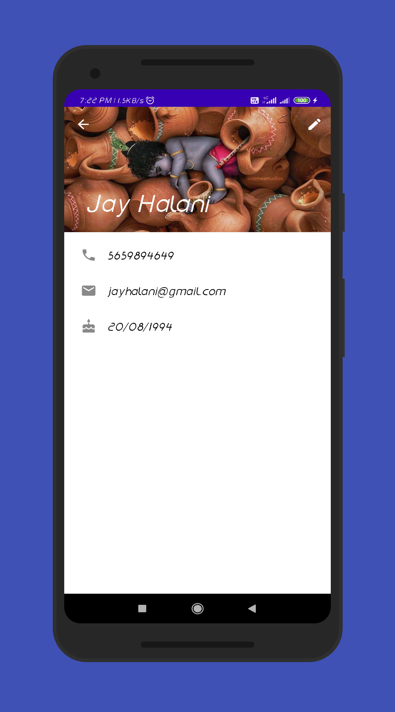

# ContactsFirebase
A lite Contact app, that lets you save contact information. This app uses MVVM architecture, Android Architecture Components and Firebase.

## Tech Specs
- <b>Language</b>: Kotlin
- <b>Pattern</b>: MVVM
- <b>MinSdkVersion</b>: 21
- <b>TargetSdkVersion</b>: 29
- <b>Development Tool</b>: Android Studio

## Libraries Used
* [Android Support Library](https://developer.android.com/topic/libraries/support-library/)
* [Firebase](https://firebase.google.com/)
* [Glide](https://github.com/bumptech/glide)
* [ViewModel](https://developer.android.com/topic/libraries/architecture/viewmodel)
* [LiveData](https://developer.android.com/topic/libraries/architecture/livedata)

## Screenshots

